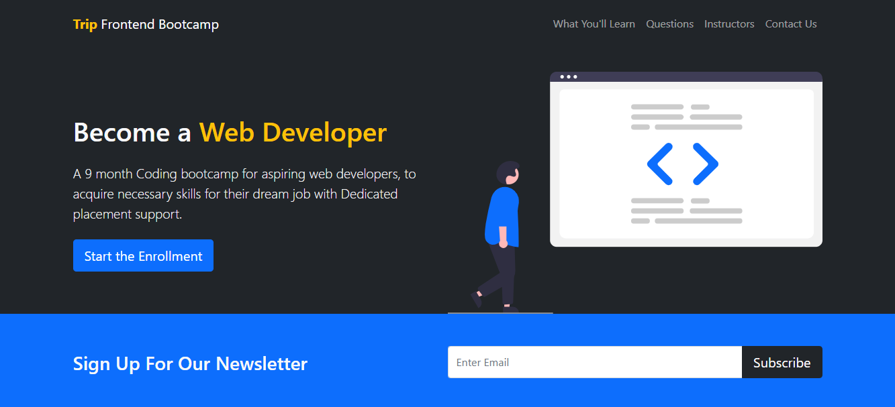
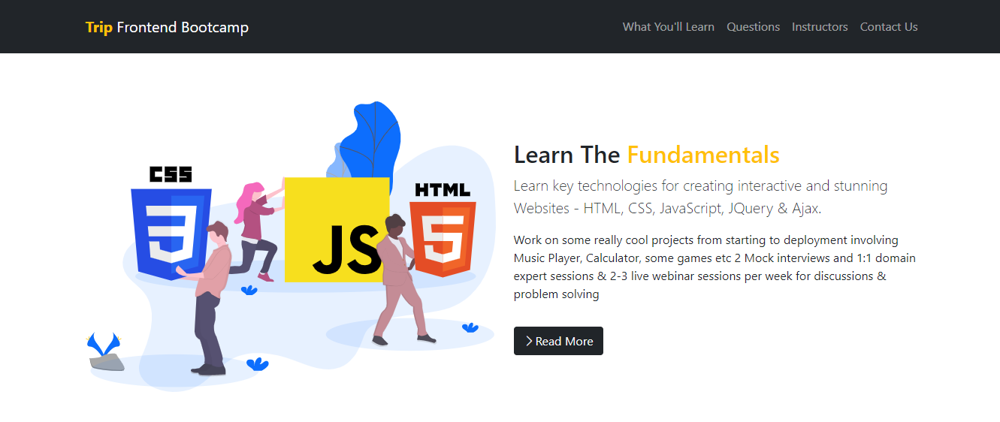
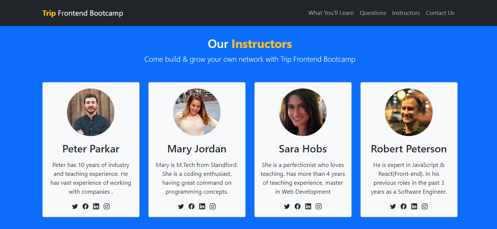
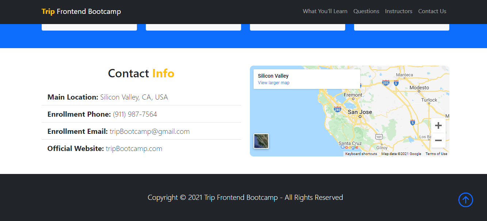

# TRIP-Frontend Bootcamp Website

>Simple one page website for a fake bootcamp

## Tech Stack

**Frontend:** Html 5, Bootstrap 5

## Website Demo

[Visit TRIP-Frontend Bootcamp Website ](https://akashsabale01.github.io/TRIP-Frontend_Bootcamp_website/) 
 :link:

  
## Lessons Learned

:white_check_mark: Responsive Navbar

:white_check_mark: Flex and Grid

:white_check_mark: Cards
  
:white_check_mark: Modal

:white_check_mark: Use Accordion for FAQ

:white_check_mark: How to use Bootstrap Icons

:white_check_mark: How to add Map from google map

## Screenshots of Website

### Website Homepage
 

### Info-cards
 

### About Pages 
 

 

## Frequently Asked Questions (FAQ)
 

### Instructors info
 

### Contact info & Map
 
